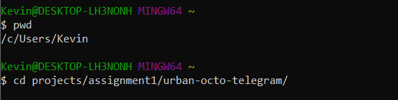
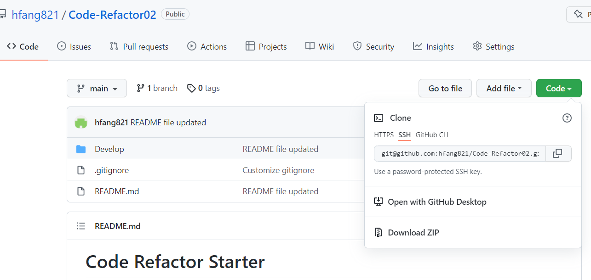
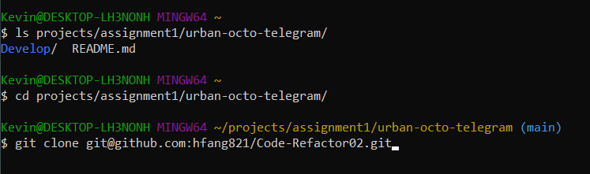
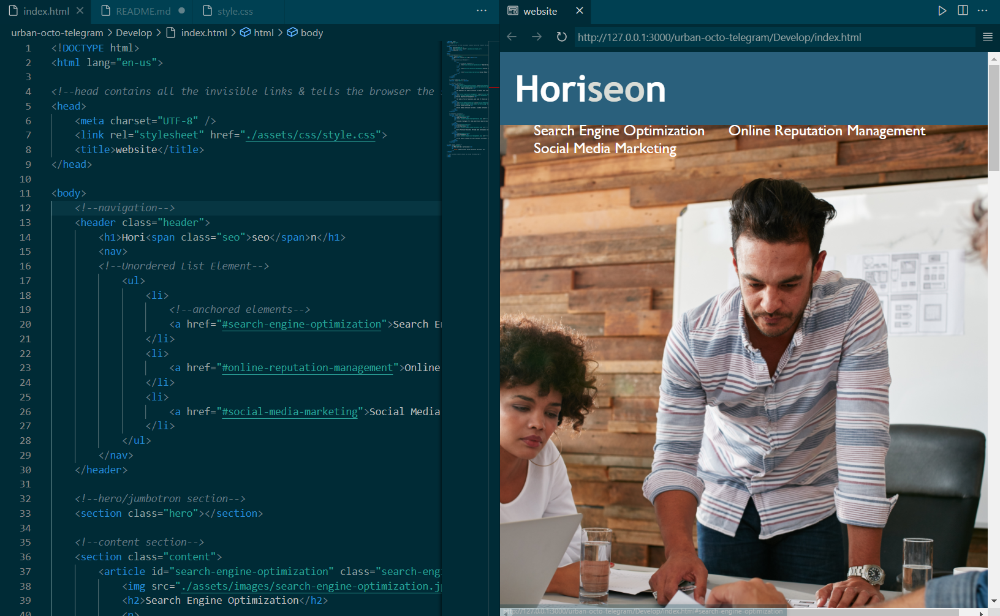

# Code Refactor Starter 

## Description:

* This website is designed to help out clients to understand the use and benefits of three valuable digital marketing tools: Search Engine Optimization (SEO), Online Reputaiton Management and Social Media Marketing.  
* This project was completed based on the basic HTML & CSS concepts, producing an intuitive, accessible demonstration of the technologies provided by "Horiseon Social Solution Services, Inc.".
* By viewing the content, our clients can easily select the service of their choice.
* During the process of improving the website, I have learned the tools & skills necessary to design a website that is clear, accessible, and learned how to troubleshoot the mysterious mistakes using Chrome's DevTools, as well as following the appropriate semantic element structure of the HTML elements, and including comments for each element/section of the page.

## How to Install:

### Windows Users:

* Open Gitbash, navigate towards your project location from your root by using "cd ./ project location"

* Choose a clone option from my "run-buddy" repository (either HTTPS or SSH should work)

* In Gitbash, type "git clone HTTPS or SSH"

* Once the clone is successful, open Visual Studio Code and  you are ready to go!

### MacOS Users: 

* Coming Soon!

## Link to the deployed application: 

https://hfang821.github.io/code-refactor/

---

## Credit

I appreciate University of Toronto School of Continuing Studies-Coding Bootcamp for providing me with the training and resources to succeed in this project!